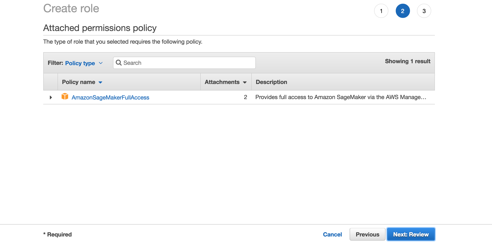
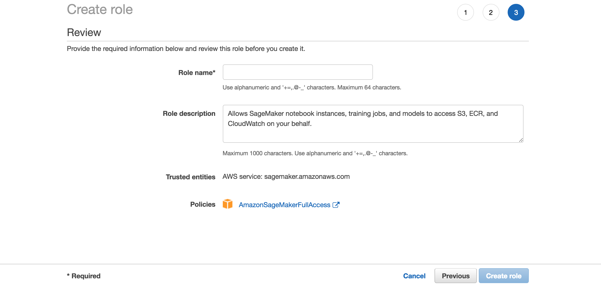
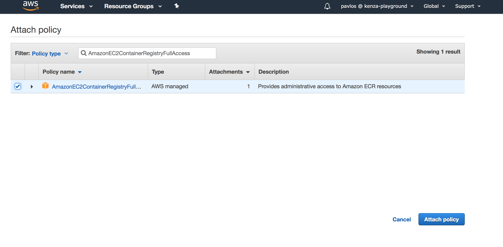
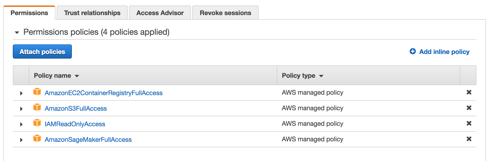
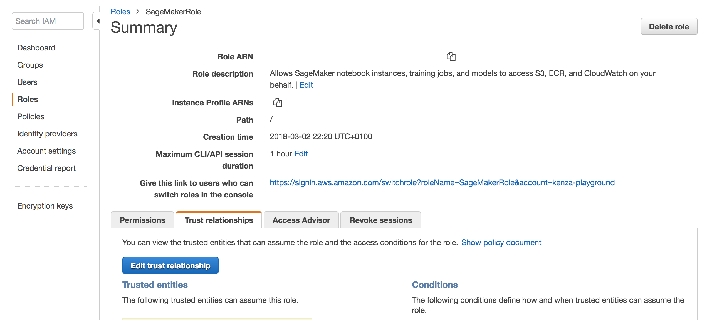

## Setup AWS Profile

- Sign in to the AWS Management Console as an IAM user and open the IAM console at <https://console.aws.amazon.com/iam/>
- Select `Roles` from the list in the left-hand side, and click on *Create role*
- Then, select *SageMaker* as the image shows:

- Click *Next: Review* on the following page:

- Type a name for the SageMaker role, i.e. `AthensSageMaker`, and click on *Create role*:

- Click on the created role and, then, click on *Attach policy* and search for `AmazonEC2ContainerRegistryFullAccess`. Attach the corresponding policy:

- Do the same to attach the `AmazonS3FullAccess` and `IAMReadOnlyAccess` policies, and end up with the following:

- Now, go to Users page by clicking on *Users* on the left-hand side.

- Click on *Add user* and type *athens-sagemaker* as username.

- Copy the ARN of that user.

- Then, go back the page of the Role you created and click on the *Trust relationships* tab:

- Click on *Edit trust relationship* and add the following:

        {
            "Version": "2012-10-17",
            "Statement": [
                {
                    "Sid": "",
                    "Effect": "Allow",
                    "Principal": {
                        "AWS": "PASTE_THE_ARN_YOU_COPIED_EARLIER",
                        "Service": "sagemaker.amazonaws.com"
                    },
                    "Action": "sts:AssumeRole"
                }
            ]
        }
        
- You're almost there! Make sure that you have added the IAM user in your `~/.aws/credentials` file. For example:
    
        [athens-sagemaker]
        aws_access_key_id = ...
        aws_secret_access_key = ...

 - And, finally, add the following in the `~/.aws/config` file:
 
        [profile athens-sagemaker]
        region = us-east-1
        role_arn = COPY_PASTE_THE_ARN_OF_THE_CREATED_ROLE_NOT_USER! for example: arn:aws:iam::...:role/PacktSageMaker
        source_profile = athens-sagemaker

- That's it! You'ready to start using SageMaker!
